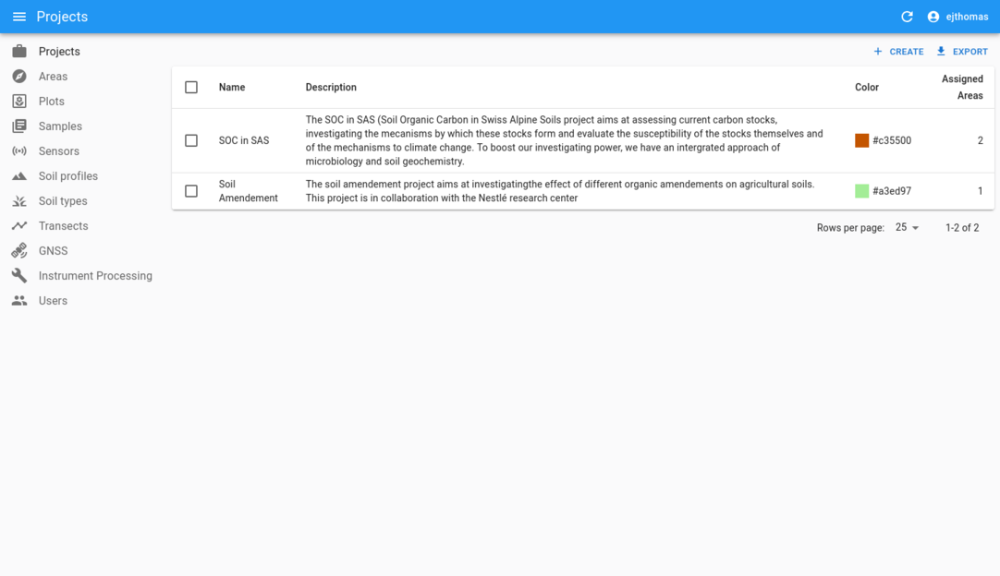
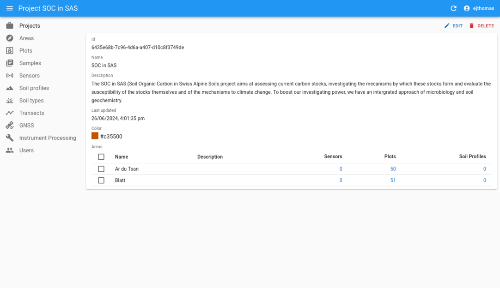
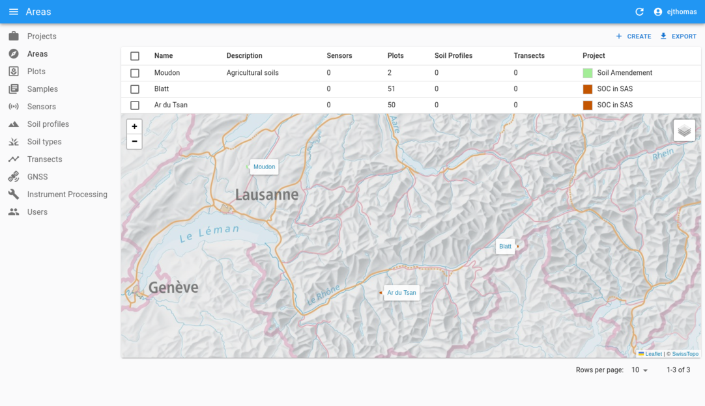
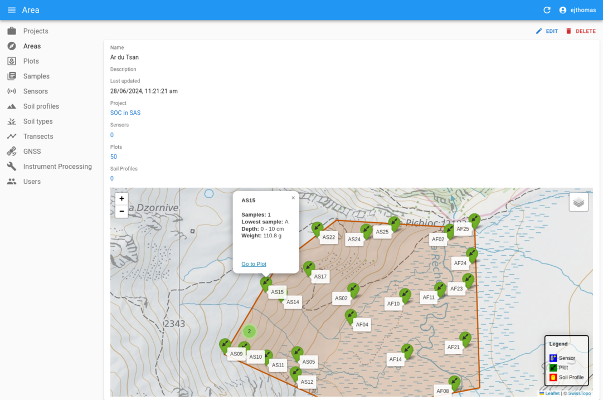
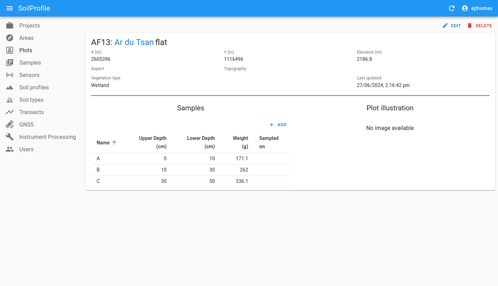
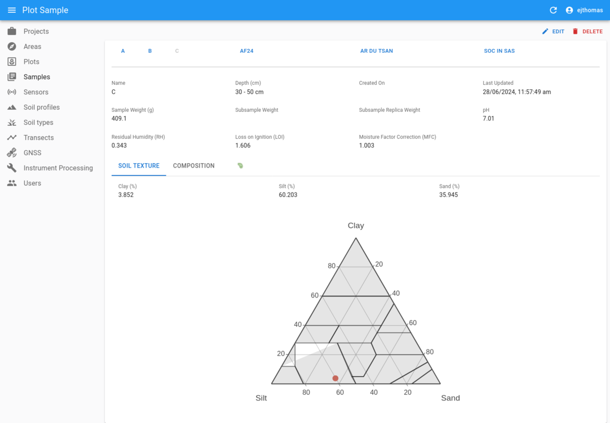
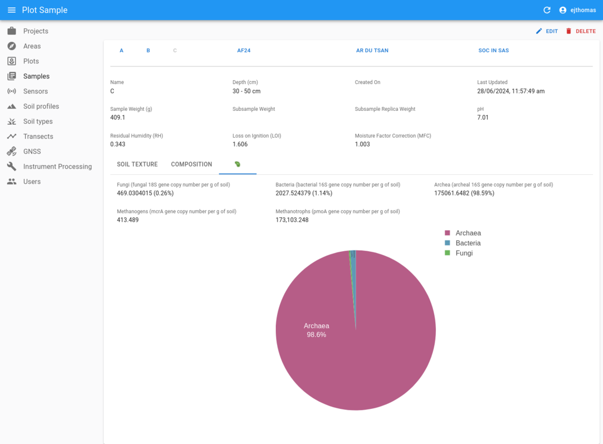
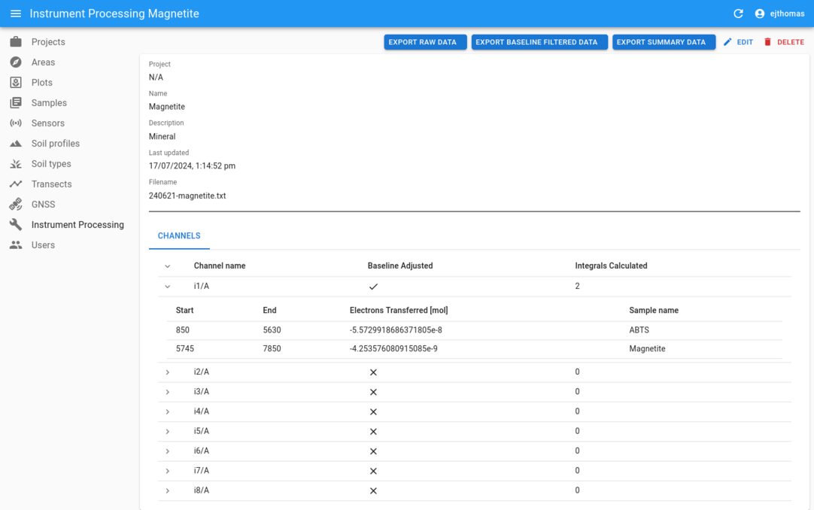
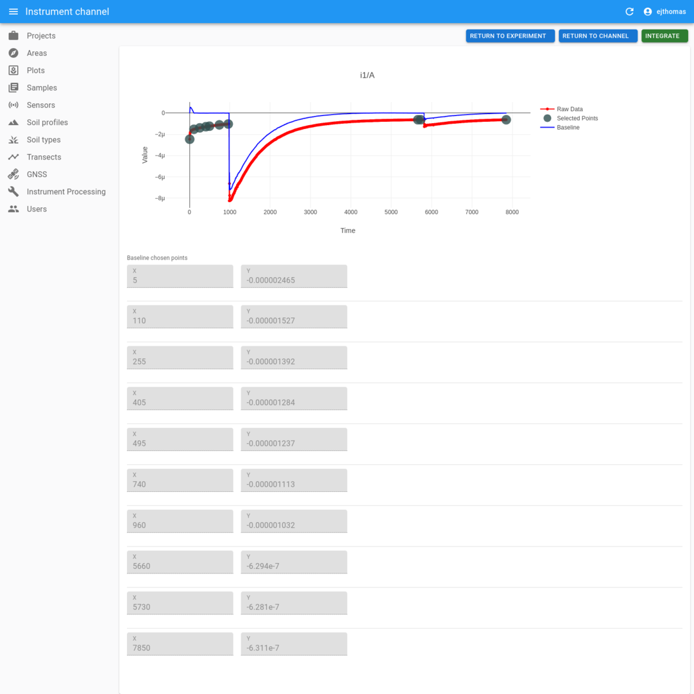
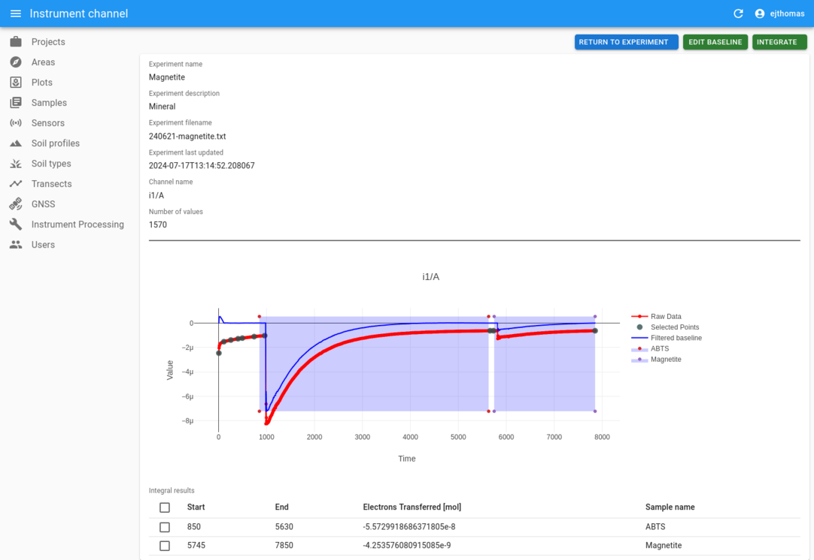

# SOIL Sensormap

Sensormap is a project to assist in fieldwork for the
[Soil Biogeochemistry Laboratory](https://www.epfl.ch/labs/soil/) at EPFL. The
project is a fullstack application to handle soil samples and profiles in the
field, as well as processing tools to handle instrument data.

## Table of contents

- [Application relationships](#application-relationships)
- [Development](#development)
    - [UI](#ui)
    - [BFF](#bff)
    - [API](#api)
    - [Quick start](#quick-start)
- [User guide](#user-guide)
    - [Projects](#projects)
    - [Areas](#areas)
    - [Plots](#plots)
    - [Samples](#samples)
    - [Instrument Processing](#instrument-processing)
- [Attribution](#attribution)
- [License](#license)

### Application relationships
This repository contains the frontend application for the project, and consists
of the following external repositories:

- [sensormap-bff](https://github.com/LabSOIL/sensormap-bff) - The
Backend-for-Frontend (BFF) to proxy requests between Keycloak and the SOIL-API.

- [soil-api](https://github.com/LabSOIL/soil-api) - The REST API for SOIL
related projects (including this one).


## Development

The changelog can be found in the [CHANGELOG](./CHANGELOG.md) file. For
backend changes, refer to their respective repositories.

The application is built with the following libraries and frameworks:

#### UI

- [React](https://reactjs.org/)
- [Material-UI](https://material-ui.com/)
- [React-Admin](https://marmelab.com/react-admin/)
- [Leaflet](https://leafletjs.com/)

### BFF

- [FastAPI](https://fastapi.tiangolo.com/)
- [Keycloak](https://www.keycloak.org/)

### API

- [FastAPI](https://fastapi.tiangolo.com/)
- [SQLModel](https://sqlmodel.tiangolo.com/)
- [PostgreSQL](https://www.postgresql.org/)


### Quick start

There is a docker-compose file to start the application in development mode. To
start the application:

1. Clone the repositories above into the folder beneath this one, as to have
the following structure:

```bash
.
├── sensormap-bff
├── sensormap-ui
└── soil-api
```

```bash
mkdir -p ./sensormap
cd ./sensormap

git clone http://github.com/LabSOIL/sensormap-bff
git clone http://github.com/LabSOIL/sensormap-ui
git clone http://github.com/LabSOIL/soil-api
```

2. Setup a Keycloak instance with a realm and client suitable for development
for both the UI and the BFF independently, and then in this `sensormap-ui`
repository, create a `.env` file with the Keycloak configuration similar to
below:

```bash
KEYCLOAK_CLIENT_ID=sensormap-frontend-local
KEYCLOAK_BFF_ID=sensormap-frontend-local-bff
KEYCLOAK_BFF_SECRET=<BFF_CLIENT_SECRET>
KEYCLOAK_REALM=SOIL
KEYCLOAK_URL=https://<KEYCLOAK_ROOT_URL/
```

Note: Make sure the user you will be using has the realm role 'admin'.

3. Start the application from within this repository (sensormap-ui) with the
following command (this will build the images and start the containers):

```bash
docker-compose up --build
```

4. In the default configuration, the application will be available at
`http://soil:88`. Therefore, you will need to add the following line to your
`/etc/hosts` file:

```bash
echo -e "127.0.0.1\tsoil" | sudo tee -a /etc/hosts
```

If this is undesired, the hostname can be changed in the `docker-compose.yml`
file.

5. The application should now be available at `http://soil:88`. Login with your
Keycloak credentials and you should be able to access the application.


## User guide

The application is designed to be intuitive and easy to use. The main features
are:

- **Projects**: Create projects to group elements of the other components
together. For example, areas, plots, samples, and soil profiles.
- **Areas**: These are the regions in which plots and samples are taken.
- **Plots**: Create plots within areas to represent the location of samples,
sensors and transects.
- **Samples**: Represent soil samples taken from plots, and their
characteristics, including chemical composition, and texture.
- **Sensors**: Relate to sensors placed in the field that collect data related
to a plot.
- **Soil Profiles**: Represent the vertical distribution of soil properties in
a plot.
- **Soil Types**: Define the soil types that can be assigned to soil profiles.
- **Transects**: Represent a relationship of several plots in a line.
- **GNSS**: Allows the uploading of handheld GPX waypoint data to enable the
creation of plots and soil profiles from field locations.
- **Instrument Processing**: Tools to process instrument data in the lab that
may relate to samples taken from the field.


### Projects

The main view of the application is the projects view. Here you can see all the
projects for the lab that have been created.



Clicking on a project will take you to the project view, where you can see a
list of areas. The project allows other components to be consolidated together,
and defines the colour its assets are represented in associated components,
such as in map views.



### Areas

The areas view allows you to see all of the areas in the field on a map. Areas
represent the regions in which plots, sensors, soil profiles and samples are
defined.



Clicking on an area will take you to the area view, where you can see a list of
plots, sensors, soil profiles and samples associated with the area on a map.
The region is represented by a polygon on the map, dynamically generated as
the convex hull of the plots in the area.

You can visualise a summary of the components by clicking on them, and move
through to their respective record views.



### Plots

The plots view allows you to see all of the plots in the field on a map. Plots
represent the location of samples, can have sensors associated with them, and
can be part of transects.



An image of a plot can be uploaded to represent the location in the field, and
the associated samples can be viewed and navigated to on the left

### Samples

The samples view shows the data collected from each sample, including the
texture, chemical composition, and other properties. A sample is defined by
its depth, where A, B, and C generally represent the soil at different
depths. You can navigate to the other samples at the top left of the page.




### Instrument Processing

The instrument processing view allows you to upload instrument data files to
process them into the database. The workflow replicates the
`InstrumentProcessing.ipynb` notebook available in the
[lab-codes](https://github.com/LabSOIL/lab-codes) repository.





The workflow allows you to upload a file from a supported instrument, and
process it into the database. The processed data can be baseline filtered
interactively, and samples can be integrated and spliced out of the data, and
finally exported.





## Attribution

This project was developed by [Evan Thomas](https://github.com/evanjt) and the
[Soil Biogeochemistry Laboratory](https://www.epfl.ch/labs/soil/) at EPFL.

## Disclaimer

The images used in this README are for illustrative purposes and have been
created for the purpose of demonstration and testing.

## License

This project is licensed under the MIT License - see the [LICENSE](./LICENSE.md)
file for details.
